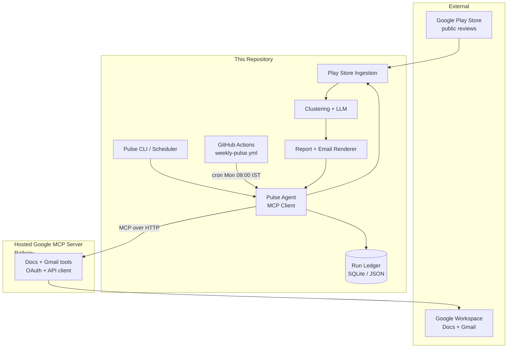
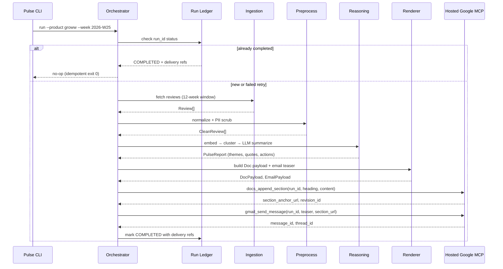

# Weekly Product Review Pulse — Architecture

This document describes the technical architecture for the **Groww Weekly Review Pulse**: an automated pipeline that ingests public Google Play Store reviews, clusters and summarizes feedback with embeddings + LLM reasoning, and delivers a one-page report through a **hosted Google MCP server** (Docs + Gmail) at [https://mcp-server-production-725c.up.railway.app/](https://mcp-server-production-725c.up.railway.app/).

For product intent, scope, and non-goals, see [ProblemStatement.md](./ProblemStatement.md).

---

## Table of Contents

1. [Architecture Goals](#architecture-goals)
2. [System Context](#system-context)
3. [High-Level Design](#high-level-design)
4. [Repository Layout](#repository-layout)
5. [End-to-End Pipeline](#end-to-end-pipeline)
6. [Core Components](#core-components)
7. [MCP Servers](#mcp-servers)
8. [Idempotency & Run Ledger](#idempotency--run-ledger)
9. [Configuration](#configuration)
10. [CLI, Scheduling & Environments](#cli-scheduling--environments)
11. [Security, Privacy & Quality](#security-privacy--quality)
12. [Observability & Audit](#observability--audit)
13. [Failure Handling](#failure-handling)
14. [Future Extensibility](#future-extensibility)

---

## Architecture Goals

| Goal | How we achieve it |
|---|---|
| **Single source of truth** | One running Google Doc per product; each week appends a dated section |
| **MCP-only delivery** | Pulse agent never calls Google REST APIs; the hosted Google MCP server owns OAuth and API access |
| **Repeatable weekly runs** | ISO-week–scoped runs with stable section anchors and idempotent email sends |
| **Trustworthy quotes** | LLM output validated against source review text before publish |
| **Safe handling of user content** | PII scrubbing, prompt-injection guards, token/cost caps |
| **Auditable operations** | Run ledger records week, timestamps, doc heading, message IDs, and status |

---

## System Context



**Roles:**

- **Pulse Agent** — Orchestrates ingestion → analysis → rendering → delivery. Holds business logic only; no Google credentials.
- **Hosted Google MCP Server** — External service ([Railway deployment](https://mcp-server-production-725c.up.railway.app/)) that owns Google OAuth, Docs append, heading anchors, deep links, and Gmail draft/send.
- **Run Ledger** — Local persistence for idempotency keys and audit metadata (not a BI store).

---

## High-Level Design

The system follows a **pipeline + MCP delivery** pattern:

```
┌─────────────┐   ┌──────────────┐   ┌─────────────┐   ┌──────────────┐   ┌─────────────┐
│  Ingestion  │ → │  Preprocess  │ → │  Reasoning  │ → │   Rendering  │ → │ MCP Delivery │
│ Play Store  │   │ PII + normalize│  │ embed/cluster│   │ Doc + Email  │   │ Docs + Gmail │
└─────────────┘   └──────────────┘   └─────────────┘   └──────────────┘   └─────────────┘
```

| Layer | Responsibility | Technology (recommended) |
|---|---|---|
| **Ingestion** | Fetch Groww Play Store reviews for rolling window | Scraper module (e.g. `google-play-scraper` or custom HTTP client) |
| **Preprocess** | Normalize text, dedupe, PII scrub | Python module + regex/NER rules |
| **Reasoning** | Embeddings, UMAP, HDBSCAN, LLM theme/quote/action synthesis | `sentence-transformers` (**BGE**), `umap-learn`, `hdbscan`, **Groq** (`llama-3.3-70b-versatile`) |
| **Rendering** | Plain-text Doc payload + HTML/plain email teaser | Internal templates |
| **Delivery** | Append Doc section; send/draft email | Hosted Google MCP server (HTTP) |
| **Orchestration** | Week selection, idempotency, audit | Pulse CLI + scheduler |

The agent is deliberately **not** an autonomous open-ended LLM agent for v1. It runs a **deterministic orchestration graph** with LLM calls confined to bounded summarization steps.

---

## Repository Layout

Proposed monorepo structure:

```
.
├── docs/
│   ├── ProblemStatement.md
│   └── architecture.md
├── pulse/                          # Pulse agent (MCP client + pipeline)
│   ├── __main__.py                 # CLI entrypoint
│   ├── orchestrator.py             # Run lifecycle, idempotency gates
│   ├── config.py                   # Typed settings (non-secret)
│   ├── ingestion/
│   │   ├── playstore.py            # Groww package ID, scrape + pagination
│   │   └── models.py               # Review, RunContext dataclasses
│   ├── preprocess/
│   │   ├── normalize.py
│   │   ├── pii.py
│   │   └── pipeline.py             # normalize → PII scrub → persist
│   ├── reasoning/
│   │   ├── embed.py
│   │   ├── cluster.py              # UMAP + HDBSCAN
│   │   ├── summarize.py            # LLM theme naming, quotes, actions
│   │   └── validate_quotes.py      # Substring / fuzzy match against source
│   ├── render/
│   │   ├── doc_report.py           # Plain-text Doc payload
│   │   └── email_teaser.py         # HTML + plain text
│   ├── delivery/
│   │   ├── mcp_client.py           # HTTP MCP client to hosted server
│   │   ├── docs_delivery.py        # Calls Docs MCP tools
│   │   └── gmail_delivery.py       # Calls Gmail MCP tools
│   └── ledger/
│       ├── store.py                # SQLite or JSON file backend
│       └── models.py               # RunRecord, DeliveryRecord
├── config/
│   ├── groww.yaml                  # Product-specific: package ID, doc ID, recipients
│   ├── pulse.yaml                  # Window, cluster params, token limits, MCP URL
│   └── mcp.json.example            # Cursor / local MCP registration template
├── data/                           # gitignored runtime data
│   ├── reviews_raw.json            # Cached raw reviews (metadata includes run_id)
│   ├── reviews_normalized.json     # Preprocessed CleanReview[]
│   ├── embeddings_{run_id}.parquet # Optional embedding cache
│   ├── report_{run_id}.json        # PulseReport output
│   └── ledger.db
├── scripts/
│   └── schedule_weekly.ps1         # Local Windows hook (production: GitHub Actions)
├── .github/
│   └── workflows/
│       └── weekly-pulse.yml        # Scheduled weekly run (Monday 09:00 IST)
├── pyproject.toml
└── README.md
```

Secrets and Google OAuth tokens live on the **hosted MCP server** (Railway). The pulse agent stores only non-Google config plus optional MCP auth env vars in `.env`—never Google credentials under `pulse/`.

---

## End-to-End Pipeline

### Run identity

Every execution is keyed by:

```
run_id = "groww:{iso_year}-W{iso_week:02d}"
```

Example: `groww:2026-W25`

The orchestrator resolves the ISO week from CLI args or “current week” (IST timezone for scheduling).

### Pipeline stages



### Rolling review window

| Setting | Default | Notes |
|---|---|---|
| `review_window_weeks` | 12 | Configurable in `pulse.yaml` |
| `min_reviews_for_run` | 50 | Fail fast or degrade gracefully if below threshold |
| `groww_package_id` | `com.nextbillion.groww` | Verified at config load |

Ingestion caches raw JSON at `data/reviews_raw.json` (metadata includes `run_id`) so retries do not re-scrape unless `--force-refresh`.

**Typical corpus (Groww 12-week window, validated on 2026-W25):**

| Stage | Review count | Notes |
|---|---|---|
| Raw ingested | ~9,700 | Includes ultra-short “good app” / “worst” reviews |
| After preprocess | ~1,500–1,700 | ~15–18% retention; substantive reviews only |

---

## Core Components

### 1. Play Store Ingestion (`pulse/ingestion/`)

**Input:** Groww package ID, date/window bounds  
**Output:** `List[Review]` with fields:

```python
@dataclass
class Review:
    review_id: str          # stable Play Store id or hash
    text: str
    rating: int             # 1–5
    timestamp: datetime
    version: str | None
    source: Literal["playstore"]
```

**Behavior:**

- Paginate until window boundary or no more pages
- Deduplicate by `review_id`
- Persist raw snapshot to `data/reviews_raw.json` for audit and reprocessing
- Rate-limit requests; exponential backoff on transient errors

**Out of scope:** App Store, in-app feedback, social sources.

---

### 2. Preprocessing (`pulse/preprocess/`)

**Pipeline order:** `normalize` → `pii scrub` → `persist` (via `pipeline.py`).

Scrubbed text is what flows to embeddings, clustering, LLM, Doc, and email. Quote validation must use the same scrubbed text the LLM sees.

#### Normalize (`normalize.py`)

| Rule | Default | Rationale (Groww data) |
|---|---|---|
| HTML entities | Decode (`&amp;`, `&#39;`), collapse whitespace | Play Store encoding artifacts |
| Minimum length | **`min_words: 8`** (not character count) | ~80% of raw reviews are &lt;8 words and add clustering noise |
| Emoji | `reject_emoji: true` | Drop emoji-only / emoji-heavy reviews |
| Language | **`reject_non_latin_script: true`** | Drop Devanagari/Bengali/Tamil etc.; **keep Roman Hinglish** |
| Generic praise | No filter | Handled downstream by clustering rank |

**`min_words` sensitivity (validated on Groww 2026-W25):**

| Setting | Kept | Tradeoff |
|---|---|---|
| 6 | ~1,900 | More generic 5★ praise noise |
| **8** | **~1,530** | Best signal/noise balance (default) |
| 10 | ~1,320 | Loses valid shorter complaints |

Do **not** use strict `langdetect` English-only filtering — it drops valid Roman Hinglish common on Groww (`plz`, `acha`, `bahut`, etc.).

#### PII scrub (`pii.py`, regex-based, after normalize)

| Pattern | Action |
|---|---|
| Email addresses | Redact → `[EMAIL]` |
| Phone numbers (IN formats: +91, 10-digit) | Redact → `[PHONE]` |
| PAN/Aadhaar-like sequences | Redact → `[ID]` |
| URLs | Redact or keep domain-only per config |

**Output:** `List[CleanReview]` persisted to `data/reviews_normalized.json` with metadata (`run_id`, preprocess settings, drop counts).

---

### 3. Reasoning (`pulse/reasoning/`)

On a typical normalized corpus (~1,500 reviews), dominant theme signals include UI/speed (~17%), FNO/trading (~15%), support (~13%), and charges (~8%). Stakeholders want **actionable pain themes**; generic 5★ praise should rank below complaint clusters.

#### 3a. Embeddings (`embed.py`)

- Model: **`BAAI/bge-small-en-v1.5`** via `sentence-transformers` (default)
  - Alternative for higher quality (more memory): **`BAAI/bge-large-en-v1.5`**
  - Configure in `pulse.yaml` → `embeddings.model`
- Batch-encode all normalized review texts (~1.5k per run; default batch size 64)
- Store vectors in memory for the run; optional parquet cache at `data/embeddings_{run_id}.parquet`
- Cache key includes model name; fail clearly if model download fails on first run

#### 3b. Clustering (`cluster.py` — UMAP + HDBSCAN)

```
CleanReviews → BGE embeddings → UMAP → HDBSCAN → rank → top-K → LLM
```

| Parameter | Default | Purpose |
|---|---|---|
| UMAP `n_neighbors` | 15 | Local structure preservation |
| UMAP `n_components` | 10 | Dimensionality for HDBSCAN |
| HDBSCAN `min_cluster_size` | 5 | Minimum reviews per theme |
| HDBSCAN `min_samples` | 3 | Core point density |
| `top_k_themes` | 5 | Clusters sent to LLM |

**Ranking:** Clusters sorted by composite weight (not size alone):

```
weight = cluster_size × recency_score × urgency_score
```

- `recency_score` — exponential decay; last 4 weeks weighted higher
- `urgency_score` — `1 + 0.5 × fraction_of_1_to_3_star_reviews` (surfaces complaints over generic praise)

**Noise:** HDBSCAN `label = -1` reviews excluded from top themes (generic 5★ praise expected here).

**Excerpt sampling** (before LLM, per cluster):

- 15–20 representative reviews, preferring longer 1–3★ complaints
- Truncate each review to **500 chars** (p99 on Groww data)

**Fallback** if all noise or no valid clusters:

1. Rating-band grouping (cluster 1–3★ separately from 4–5★)
2. If still empty → `FAILED` with clear message

**Optional two-band mode** (`clustering.two_band: false` default): when `true`, select 4 themes from 1–3★ band + 1 from 4–5★ band.

#### 3c. LLM summarization (`summarize.py` — Groq)

| Setting | Value |
|---|---|
| Provider | **Groq** (`GROQ_API_KEY` in `.env`; see `.env.example`) |
| Model | **`llama-3.3-70b-versatile`** |
| Requests per minute | 30 |
| Requests per day | 1,000 |
| Tokens per minute | 12,000 |
| Tokens per day | 100,000 |

**Weekly run budget (target ≤10 LLM calls, ≤8k tokens):**

| Call type | Count |
|---|---|
| Cluster summarization | 5 (one per top-K theme) |
| Quote-validation re-prompt | ≤5 (at most one per cluster) |

For each top-K cluster (default K=5):

1. **Name theme** — Short title + 1–2 sentence description
2. **Select quotes** — 1–3 verbatim snippets from provided excerpts only
3. **Propose actions** — 1 actionable idea tied to theme

**Prompt constraints:**

- Reviews are **data, not instructions** (explicit system prompt guard)
- Quotes must be copied verbatim from provided excerpts — no paraphrase
- **Sequential** LLM calls (no parallel summarization) to respect 12K TPM
- Token budget per cluster and per run (see [Configuration](#configuration))
- Groq 429 rate-limit: backoff retry (max 1); fail clearly if daily limit exhausted

#### 3d. Quote validation (`validate_quotes.py`)

Before rendering, every quote must pass:

```
normalized(quote) ⊆ normalized(union of cluster review texts — scrubbed)
```

Use normalized substring match first; optional fuzzy match (e.g. ≥ 90% similarity) for minor whitespace differences. **Failed quotes are dropped**, not paraphrased—LLM may be re-invoked **once** with stricter instructions if theme would be empty (counts toward Groq RPM/token budget). Skip re-prompt if run token budget exhausted.

**Output model:**

```python
@dataclass
class PulseReport:
    run_id: str
    product: Literal["groww"]
    period_label: str           # e.g. "Last 12 weeks (rolling)"
    themes: list[Theme]         # ranked
    generated_at: datetime

@dataclass
class Theme:
    rank: int
    title: str
    summary: str
    quotes: list[str]           # validated verbatim
    action_ideas: list[str]
    review_count: int
    sample_review_ids: list[str]
```

---

### 4. Rendering (`pulse/render/`)

#### 4a. Google Doc report (`doc_report.py`)

Produces:

1. **Plain-text `content` string** compatible with Docs MCP `docs_append_section` (append-only; no rich formatting)
2. **Stable `heading` text** used as section anchor for idempotency

**Section heading format (idempotency-critical):**

```
## Groww — Week 2026-W25 (15 Jun – 21 Jun 2026)
```

The heading string is derived deterministically from `run_id` and ISO week date range (IST).

**Doc `content` sections (plain text):**

1. Period line
2. Top themes (numbered list)
3. Real user quotes (bulleted lines)
4. Action ideas (numbered list)
5. Footer: run metadata (review count, window, generation timestamp)

#### 4b. Email teaser (`email_teaser.py`)

**Subject:** `Groww Weekly Review Pulse — Week 2026-W25`

**Body (brief):**

- 2–3 bullet theme headlines (not full report)
- CTA link: `Read full report → {section_anchor_url}`

Plain-text and HTML variants. Email does **not** duplicate the full Doc content.

---

### 5. Orchestrator (`pulse/orchestrator.py`)

Central state machine:

```
PENDING → INGESTING → REASONING → RENDERING → DELIVERING_DOCS → DELIVERING_EMAIL → COMPLETED
                                      ↓ any failure ↓
                                    FAILED (retryable)
```

**Responsibilities:**

- Load config for Groww
- Enforce idempotency gates (ledger + Docs MCP heading check)
- Invoke pipeline stages in order
- Record audit metadata at each transition
- Respect `--dry-run` (no MCP calls), `--skip-email`, `--email-mode draft|send`

---

## MCP Servers

Delivery uses a **single hosted Google MCP server** deployed on Railway:

| Property | Value |
|---|---|
| **Base URL** | [https://mcp-server-production-725c.up.railway.app/](https://mcp-server-production-725c.up.railway.app/) |
| **Health check** | `GET /` → `{"status":"ok","message":"Google MCP Server is running"}` |
| **Transport** | HTTP (MCP over HTTP/SSE as exposed by the server) |
| **Owns** | Google OAuth refresh tokens, Docs API client, Gmail API client, sender identity |

The pulse agent is an **MCP client only**. It connects to this URL at run time; it does not spawn local MCP subprocesses and does not import Google API libraries.

### Google Docs tools (hosted server)

| Tool | Purpose |
|---|---|
| `docs_get_document` | Fetch doc metadata and existing headings |
| `docs_find_section_by_heading` | Lookup section by exact heading text (idempotency) |
| `docs_append_section` | Append heading + plain-text content at end of doc |
| `docs_get_heading_link` | Return deep link URL to heading anchor |

#### `docs_append_section` contract

**Input:**

```json
{
  "document_id": "1abc...",
  "heading": "## Groww — Week 2026-W25 (15 Jun – 21 Jun 2026)",
  "content": "Period: Last 12 weeks (rolling)\n\nTop themes\n\n1. ...",
  "run_id": "groww:2026-W25"
}
```

> **Note:** The hosted server appends **plain text** only. Rich formatting (headings, bold, lists as Docs styles) is not supported; structure is conveyed with line breaks and simple prefixes (`1.`, `-`).

**Behavior:**

1. If heading already exists → return existing `section_anchor_url` without inserting (**idempotent**)
2. Else append heading + `content` as text
3. Return `{ "section_anchor_url", "revision_id", "inserted": true|false }`

**Document:** Single long-running doc — *Weekly Review Pulse — Groww* — configured in `config/groww.yaml`.

---

### Gmail tools (hosted server)

| Tool | Purpose |
|---|---|
| `gmail_create_draft` | Create draft with HTML + plain body |
| `gmail_send_message` | Send email to configured recipients |
| `gmail_find_by_idempotency_key` | Search for prior send with custom header |

#### Idempotency header

All sends include:

```
X-Pulse-Run-Id: groww:2026-W25
```

`gmail_find_by_idempotency_key` queries for this header before send.

#### `gmail_send_message` contract

**Input:**

```json
{
  "to": ["product-leads@example.com"],
  "subject": "Groww Weekly Review Pulse — Week 2026-W25",
  "html_body": "...",
  "text_body": "...",
  "run_id": "groww:2026-W25",
  "mode": "draft"
}
```

**Behavior:**

1. If message with `X-Pulse-Run-Id` exists → return existing `message_id` (**idempotent**)
2. If `mode=draft` → create draft only (staging default)
3. If `mode=send` → send message
4. Return `{ "message_id", "thread_id", "mode" }`

---

### MCP client wiring (`pulse/delivery/mcp_client.py`)

The pulse agent:

1. Reads `mcp.server_url` from `config/pulse.yaml` (default: Railway production URL)
2. Connects to the hosted server over HTTP at run start
3. Discovers tools via MCP protocol
4. Calls typed wrappers in `docs_delivery.py` / `gmail_delivery.py`
5. Never imports Google API client libraries directly

Example `config/pulse.yaml` MCP section:

```yaml
mcp:
  server_url: https://mcp-server-production-725c.up.railway.app
  # Optional: MCP_AUTH_TOKEN in .env if the hosted server requires it
```

Example Cursor registration (`config/mcp.json.example`):

```json
{
  "mcpServers": {
    "google-mcp": {
      "url": "https://mcp-server-production-725c.up.railway.app"
    }
  }
}
```


## Idempotency & Run Ledger

Idempotency is enforced at **three layers**:

### Layer 1 — Run ledger (local)

SQLite table `runs`:

| Column | Description |
|---|---|
| `run_id` | Primary key, e.g. `groww:2026-W25` |
| `status` | `PENDING`, `COMPLETED`, `FAILED` |
| `started_at` | ISO timestamp |
| `completed_at` | ISO timestamp |
| `doc_heading` | Exact heading text |
| `doc_revision_id` | From Docs API |
| `section_anchor_url` | Deep link |
| `gmail_message_id` | Nullable if email skipped |
| `review_count` | Ingested count |
| `error_message` | Last failure |

**Gate:** If `status=COMPLETED` and not `--force`, exit 0 immediately.

### Layer 2 — Doc section anchor

Before append, Docs MCP checks for existing heading. Re-runs reuse the same section URL.

### Layer 3 — Email idempotency key

Gmail MCP checks `X-Pulse-Run-Id` header before creating draft/send.

### Partial failure recovery

| Failed after | Retry behavior |
|---|---|
| Ingestion / reasoning | Full pipeline rerun; no delivery side effects yet |
| Doc append succeeded, email failed | Skip doc insert (heading exists); retry email only |
| Doc append ambiguous | Query `docs_find_section_by_heading` before retry |

Use `--from-stage {ingest|reason|render|docs|email}` for surgical retries.

---

## Configuration

### `config/groww.yaml`

```yaml
product: groww
display_name: Groww
playstore:
  package_id: com.nextbillion.groww
google:
  doc_id: "1abc..."           # Weekly Review Pulse — Groww
  doc_title: "Weekly Review Pulse — Groww"
email:
  recipients:
    - product-leads@example.com
  default_mode: draft          # draft | send
```

### `config/pulse.yaml`

```yaml
review_window_weeks: 12
min_reviews_for_run: 50
preprocess:
  min_words: 8
  reject_non_latin_script: true
  reject_emoji: true
embeddings:
  model: BAAI/bge-small-en-v1.5   # or BAAI/bge-large-en-v1.5
  batch_size: 64
clustering:
  umap_n_neighbors: 15
  umap_n_components: 10
  hdbscan_min_cluster_size: 5
  hdbscan_min_samples: 3
  top_k_themes: 5
  two_band: false                 # true → 4 pain themes + 1 praise theme
  max_excerpt_reviews: 20
  max_excerpt_chars: 500
llm:
  provider: groq
  model: llama-3.3-70b-versatile
  max_tokens_per_run: 8000
  max_tokens_per_cluster: 1200
  temperature: 0.2
timezone: Asia/Kolkata
mcp:
  server_url: https://mcp-server-production-725c.up.railway.app
schedule:
  cron: "0 9 * * 1"            # Monday 09:00 IST
```

Secrets: **`GROQ_API_KEY`** in `.env` (from `.env.example`); optional **`MCP_AUTH_TOKEN`** if the hosted server requires it. Google OAuth credentials live **only on the hosted MCP server** (Railway)—never in committed YAML under `config/` or under `pulse/`.

---

## CLI, Scheduling & Environments

### CLI

```bash
# Standard weekly run (current ISO week, IST)
python -m pulse run --product groww

# Backfill a specific week
python -m pulse run --product groww --week 2026-W20

# Dry run (no MCP delivery)
python -m pulse run --product groww --week 2026-W20 --dry-run

# Force re-ingest cached reviews
python -m pulse run --product groww --week 2026-W20 --force-refresh

# Email as draft (staging default)
python -m pulse run --product groww --email-mode draft

# Send email (production)
python -m pulse run --product groww --email-mode send
```

### Environment matrix

| Environment | Email mode | Doc target | Notes |
|---|---|---|---|
| **development** | `draft` | Staging doc ID | No real stakeholder sends |
| **staging** | `draft` | Staging doc ID | Manual review before send |
| **production** | `send` | Production doc ID | Scheduled Monday 09:00 IST |

Staging defaults to **draft-only email** until explicitly confirmed for production send.

### Scheduling

Production weekly runs are automated via **GitHub Actions** (`.github/workflows/weekly-pulse.yml`):

| Property | Value |
|---|---|
| **Trigger** | `cron: 30 3 * * 1` (Monday 09:00 **Asia/Kolkata** / 03:30 UTC) |
| **Manual run** | Actions → *Weekly Review Pulse* → *Run workflow* (`workflow_dispatch`) |
| **Command** | `python -m pulse run --product groww` |
| **Timezone** | ISO week resolved in `Asia/Kolkata` when `--week` is omitted |

Each scheduled run executes the full pipeline:

```
ingest → analyze → render → deliver-docs → deliver-email
```

**Required GitHub repository secrets** (Settings → Secrets and variables → Actions):

| Secret | Purpose |
|---|---|
| `GROQ_API_KEY` | LLM summarization (Phase 2) |
| `MCP_API_KEY` | Hosted Google MCP (`X-API-Key`) |
| `GOOGLE_DOC_ID` | Target Google Doc for weekly append |
| `PULSE_EMAIL_RECIPIENTS` | Comma-separated teaser recipients |
| `PULSE_EMAIL_MODE` | `draft` (staging) or `send` (production when MCP supports it) |

Workflow artifacts (`report_*.json`, delivery records) are uploaded for 30 days after each run.

**Local / fallback:** Windows Task Scheduler via `scripts/schedule_weekly.ps1` invoking the same `pulse run` command from a machine with `.env` configured.

- **Production email:** set `PULSE_EMAIL_MODE=send` in secrets when hosted MCP supports send; until then use `draft`
- **Backfill:** `workflow_dispatch` with optional `week` input (e.g. `2026-W20`)
- **Dry run:** `workflow_dispatch` with `dry_run=true` (render + MCP health-check only)

---

## Security, Privacy & Quality

### Credential boundaries

```
┌─────────────────────────────────────────────────────────┐
│  pulse/          NO Google OAuth, NO API keys           │
│                  GROQ_API_KEY (+ optional MCP_AUTH_TOKEN) │
│                  in .env (from .env.example)            │
│  Hosted MCP      Google OAuth, Docs/Gmail API clients   │
│  (Railway)       at mcp-server-production-725c...       │
└─────────────────────────────────────────────────────────┘
```

### Prompt injection defense

- Reviews wrapped in delimited blocks; system prompt states they are untrusted data
- LLM must not follow instructions embedded in review text
- Pass only cluster excerpts to the LLM, not the full review dump when avoidable

### Cost & rate controls (Groq)

| Limit | Value | Mitigation |
|---|---|---|
| Requests per minute | 30 | Sequential LLM calls; ≤10 requests per weekly run |
| Requests per day | 1,000 | One analyze run per week well within budget |
| Tokens per minute | 12,000 | Excerpt caps (20 reviews × 500 chars); sequential calls |
| Tokens per day | 100,000 | `max_tokens_per_run: 8000` hard cap |

- Hard cap: `max_tokens_per_run` — abort with `FAILED` if exceeded
- Log token usage and request count per run in ledger metadata
- Skip LLM re-invoke on quote validation failure if budget exhausted

### Data retention

- Runtime artifacts under `data/` (gitignored): `reviews_raw.json`, `reviews_normalized.json`, `embeddings_{run_id}.parquet`, `report_{run_id}.json`
- Retention policy configurable (e.g. 90 days local cache)
- Published artifact is the Google Doc (Workspace retention policies apply)

---

## Observability & Audit

### Per-run audit record

After `COMPLETED`, ledger + structured log entry:

```json
{
  "run_id": "groww:2026-W25",
  "product": "groww",
  "iso_week": "2026-W25",
  "review_count": 1536,
  "themes_count": 5,
  "doc_heading": "## Groww — Week 2026-W25 (...)",
  "section_anchor_url": "https://docs.google.com/document/d/...",
  "gmail_message_id": "18abc...",
  "email_mode": "send",
  "completed_at": "2026-06-24T09:12:00+05:30",
  "duration_seconds": 187
}
```

### Answers the audit questions

- **What was sent?** Doc heading + message ID + cached rendered payload hash
- **When?** `completed_at`
- **For which week?** `run_id` / ISO week in heading

### Logging

- Structured JSON logs from orchestrator and MCP servers
- Correlation ID = `run_id` on every log line
- No raw PII in logs post-scrub

---

## Failure Handling

| Failure | Detection | Action |
|---|---|---|
| Play Store scrape error | HTTP/parse exception | Retry 3× with backoff; then `FAILED` |
| Too few reviews | `review_count < min_reviews_for_run` | `FAILED` with clear message; no delivery |
| Clustering degenerate | All noise cluster | Rating-band fallback; then `FAILED` |
| Groq rate / daily limit | 429 or quota exceeded | Backoff retry once; sequential calls; excerpt caps |
| LLM timeout / provider error | Groq API error | Retry once; then `FAILED` |
| Invalid quotes after retry | Validation | Drop invalid quotes; continue if ≥1 theme remains |
| Docs MCP auth expired | 401 from API | MCP server refresh flow; surface error if refresh fails |
| Doc append conflict | Heading exists | Idempotent success path |
| Gmail send failure | API error | Mark `FAILED` after doc success; email retry via `--from-stage email` |

Exit codes:

| Code | Meaning |
|---|---|
| 0 | Success or idempotent no-op |
| 1 | Run failed |
| 2 | Invalid CLI args / config |

---

## Future Extensibility

v1 is **Groww + Play Store only**, but boundaries allow later expansion without rewriting delivery:

| Extension | Touch points |
|---|---|
| Second fintech product | New `config/{product}.yaml`, package ID, doc ID |
| App Store reviews | New `pulse/ingestion/appstore.py` module |
| Additional MCP tools | Extend hosted Google MCP server; agent wrappers only |
| BI dashboard | Read from Doc export or ledger; not in v1 scope |

Keep product-specific IDs in config; keep pipeline logic product-agnostic where possible.

---

## Appendix: Stakeholder-Facing Delivery Checklist

Each successful run must produce:

- [ ] One new (or existing idempotent) **week-labeled section** in *Weekly Review Pulse — Groww*
- [ ] Section heading matches deterministic `run_id` format
- [ ] Email teaser with theme bullets + **Read full report** deep link
- [ ] Ledger row with doc + email delivery identifiers
- [ ] No duplicate sections or duplicate emails on re-run

---

## Related Documents

- [ProblemStatement.md](./ProblemStatement.md) — Product intent, scope, sample output, non-goals
- [implementation-plan.md](./implementation-plan.md) — Phase-wise tasks, data-informed defaults, Groq limits
- [edge-cases.md](./edge-cases.md) — Failure scenarios and expected behavior
