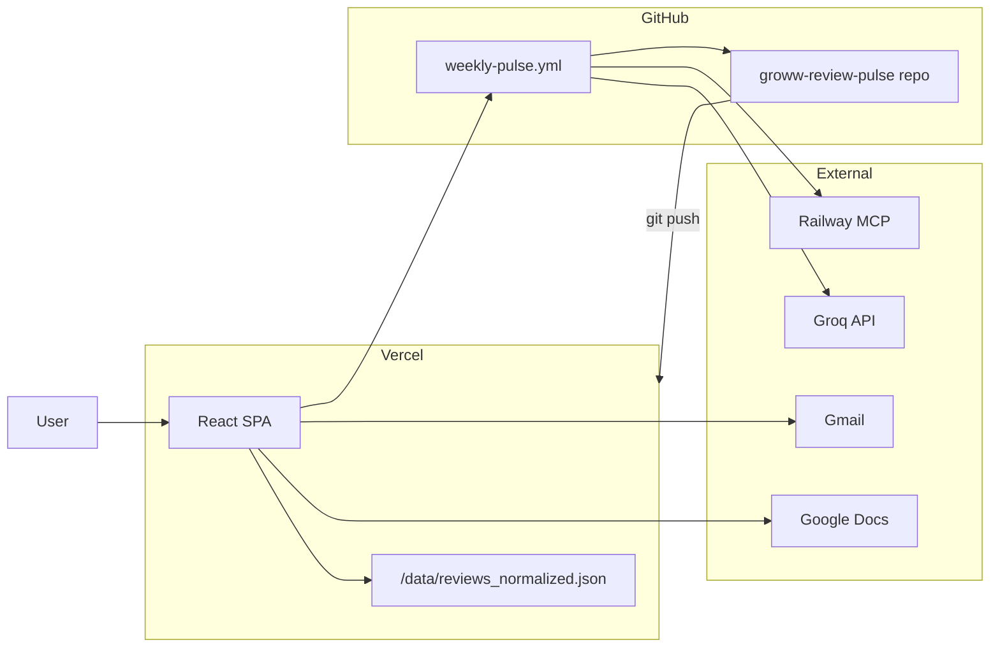

# Deployment Plan 2 — Frontend UI on Vercel

Deploy the **Groww Weekly Review Pulse** React dashboard (`frontend/`) as a static site on [Vercel](https://vercel.com). The backend pipeline (Python `pulse`, GitHub Actions, Railway MCP) stays unchanged; only the UI is hosted on Vercel.

---

## 1. What gets deployed

| Item | Location | On Vercel |
|------|----------|-----------|
| Dashboard UI | `frontend/` | ✅ Static build (`dist/`) |
| Review Explorer data | `frontend/public/data/reviews_normalized.json` | ✅ Served as static JSON (~0.6 MB) |
| Dashboard KPIs / themes / delivery links | `frontend/src/data/mock.ts` | ✅ Baked into JS bundle at build time |
| Python pipeline | `pulse/` | ❌ Not on Vercel (GitHub Actions + local) |
| MCP server | Railway | ❌ External service (linked from UI footer) |

**Routes (client-side SPA):**

| Path | Page |
|------|------|
| `/` | Dashboard |
| `/explorer` | Review Explorer (all processed reviews) |
| `/pipeline` | Pipeline Monitor |

---

## 2. Architecture after deploy



**Flow:** GitHub Actions runs the weekly pipeline → (optional) syncs review JSON into `frontend/public/data/` and pushes → Vercel rebuilds → stakeholders open the Vercel URL instead of running `npm run dev` locally.

---

## 3. Prerequisites

- [ ] GitHub repo pushed: `https://github.com/SayaliAsole26/groww-review-pulse`
- [ ] Vercel account (GitHub login recommended)
- [ ] At least one successful local pipeline run so `data/reviews_normalized.json` exists
- [ ] Node.js **20+** locally (matches Vercel default)

---

## 4. Critical: review data on Vercel

The Review Explorer loads processed reviews from:

```
GET /data/reviews_normalized.json
```

That file is produced by:

1. `python -m pulse ingest` → writes `data/reviews_normalized.json` (repo root, **gitignored**)
2. `npm run sync-reviews` → copies it to `frontend/public/data/reviews_normalized.json`

Vercel clones the repo only — it does **not** have `data/reviews_normalized.json` unless you provide it. Without the synced copy, the build still succeeds (sync script exits 0 with a warning), but **Review Explorer shows an error** in production.

### Choose one data strategy

| Strategy | Best for | Effort |
|----------|----------|--------|
| **A. Commit synced JSON** | First deploy, quick demo | Low |
| **B. Automate sync in GitHub Actions** | Weekly production updates | Medium (recommended) |
| **C. Future API** | Live KPIs + reviews from backend | High (post-v1) |

#### Strategy A — Commit synced JSON (first deploy)

```bash
# From repo root, after ingest
python -m pulse ingest
cd frontend && npm run sync-reviews
```

Then commit the synced file:

```bash
git add frontend/public/data/reviews_normalized.json
git commit -m "Add processed reviews for Review Explorer deploy"
git push
```

Optionally allow this path in git while keeping root `data/` ignored — add to `.gitignore`:

```gitignore
# Allow deployed review snapshot for Vercel (PII-scrubbed)
!frontend/public/data/reviews_normalized.json
```

#### Strategy B — Automate in `weekly-pulse.yml` (recommended)

Add steps after a successful pipeline run:

```yaml
      - name: Sync reviews for frontend
        run: |
          cd frontend
          npm ci
          npm run sync-reviews

      - name: Commit and push review snapshot
        if: success() && github.ref == 'refs/heads/main'
        run: |
          git config user.name "github-actions[bot]"
          git config user.email "github-actions[bot]@users.noreply.github.com"
          git add frontend/public/data/reviews_normalized.json
          git diff --staged --quiet || git commit -m "chore: sync reviews for Vercel UI [skip ci]"
          git push
```

Use `[skip ci]` on the commit message if you want to avoid a double GitHub Actions run; Vercel will still redeploy on push.

> **Note:** Only commit PII-scrubbed normalized reviews. Never commit `data/reviews_raw.json` or secrets.

---

## 5. Vercel project setup

### 5.1 Import repository

1. Go to [vercel.com/new](https://vercel.com/new)
2. Import **groww-review-pulse**
3. Configure the project:

| Setting | Value |
|---------|-------|
| **Framework Preset** | Vite |
| **Root Directory** | `frontend` |
| **Build Command** | `npm run build` |
| **Output Directory** | `dist` |
| **Install Command** | `npm install` |
| **Node.js Version** | 20.x (Project → Settings → General) |

4. Deploy (first build may succeed but Explorer empty if Strategy A not done yet)

### 5.2 SPA routing (`vercel.json`)

Direct visits to `/explorer` or `/pipeline` need a fallback to `index.html`. Create `frontend/vercel.json`:

```json
{
  "rewrites": [
    { "source": "/((?!assets|data|favicon).*)", "destination": "/index.html" }
  ]
}
```

This preserves static assets and `/data/*` while routing app paths to the SPA.

### 5.3 Production branch

- **Production branch:** `main`
- Enable **Automatic deployments** for `main`
- Optional: preview deployments for PRs (default on Vercel)

---

## 6. Environment variables (optional, v1)

Most UI values are hardcoded in `frontend/src/data/mock.ts` (doc URL, Gmail link, GitHub Actions URL, KPIs). No env vars are required for a first deploy.

For future dynamic config without code changes, migrate to Vite env vars:

| Vercel env var | Example | Used for |
|----------------|---------|----------|
| `VITE_GOOGLE_DOC_URL` | `https://docs.google.com/document/d/.../edit` | Footer “Google Docs” link |
| `VITE_GITHUB_ACTIONS_URL` | `https://github.com/.../actions` | Footer link |
| `VITE_MCP_URL` | `https://mcp-server-production-725c.up.railway.app` | Pipeline page (if re-wired) |
| `VITE_CURRENT_WEEK` | `2026-W25` | Header badge |

Access in code: `import.meta.env.VITE_GOOGLE_DOC_URL`

Set in: **Vercel → Project → Settings → Environment Variables** (Production + Preview).

---

## 7. Deploy checklist

### One-time setup

- [ ] Complete Strategy A or B so `frontend/public/data/reviews_normalized.json` exists in git
- [ ] Add `frontend/vercel.json` for SPA rewrites
- [ ] Import repo on Vercel with **Root Directory = `frontend`**
- [ ] Confirm first deploy is green in Vercel dashboard
- [ ] Open production URL and verify all three routes

### Post-deploy verification

| Check | Expected |
|-------|----------|
| `/` loads | Dashboard KPIs, 3 themes, charts |
| `/explorer` loads | “1,669 processed reviews” (or current count), rating filters with counts |
| `/pipeline` loads | Re-run Pipeline button; no MCP Health / Start Batch |
| Footer links | Google Doc, Gmail Drafts, GitHub Actions open in new tab |
| Mobile nav | Bottom bar works on small screens |
| Hard refresh on `/explorer` | No 404 (vercel.json rewrites working) |

### After each weekly pipeline run

- [ ] Strategy B: confirm Actions committed updated `reviews_normalized.json`
- [ ] Vercel redeploy finished (Deployments tab)
- [ ] Review Explorer shows new review count / week metadata
- [ ] Optionally update `mock.ts` KPIs/themes manually until live API exists

---

## 8. Custom domain (optional)

1. Vercel → Project → **Settings → Domains**
2. Add domain (e.g. `pulse.yourdomain.com`)
3. Add DNS records Vercel provides (CNAME or A)
4. Wait for SSL provisioning (automatic)

No code changes required.

---

## 9. Local vs production parity

```bash
# Local dev (syncs reviews automatically via predev)
cd frontend
npm install
npm run dev
# → http://localhost:5173

# Production-like preview locally
npm run build
npm run preview
# → http://localhost:4173
```

---

## 10. Troubleshooting

| Symptom | Cause | Fix |
|---------|-------|-----|
| Review Explorer: “Processed reviews not found” | Missing `public/data/reviews_normalized.json` on deploy | Run Strategy A or B |
| 404 on `/explorer` refresh | Missing SPA rewrite | Add `frontend/vercel.json` |
| Build fails: TypeScript errors | Local changes not pushed | Fix locally, `npm run build`, push |
| Build fails: `npm install` | Lockfile out of sync | Run `npm install` in `frontend/`, commit `package-lock.json` |
| Wrong review count vs dashboard | Dashboard uses `mock.ts`; Explorer uses JSON | Update both after pipeline, or wire KPIs to JSON metadata later |
| Stale data after weekly run | No auto-sync commit | Implement Strategy B |
| Vercel builds root instead of frontend | Wrong root directory | Set Root Directory to `frontend` in project settings |

---

## 11. Security & privacy

- Deploy only **PII-scrubbed** normalized reviews (already scrubbed in `pulse` preprocess).
- Do **not** set Vercel env vars for `GROQ_API_KEY`, `MCP_API_KEY`, or Google OAuth — those belong in GitHub Actions secrets and Railway only.
- The UI is a **read-only dashboard**; “Re-run Pipeline” is a client-side simulation today — it does not trigger GitHub Actions or `pulse run` remotely.
- If the repo is public, anyone can read `/data/reviews_normalized.json`. Use a private repo or Vercel **Deployment Protection** if access should be restricted.

---

## 12. Future improvements (post-v1)

| Improvement | Benefit |
|-------------|---------|
| GitHub Actions `workflow_dispatch` link from Pipeline page | Real remote re-run |
| Serverless API route (`/api/status`) reading `data/report_*.json` artifacts | Live KPIs without editing `mock.ts` |
| Vercel Blob / R2 for large review history | Avoid bloating git with weekly JSON commits |
| Password / Vercel Authentication | Stakeholder-only access |

---

## 13. Quick reference commands

```bash
# Prepare data for deploy
python -m pulse ingest
cd frontend && npm run sync-reviews

# Verify build locally before pushing
cd frontend && npm run build

# Manual Vercel CLI deploy (optional)
npm i -g vercel
cd frontend
vercel          # preview
vercel --prod   # production
```

---

## Related documents

- [implementation-plan.md](./implementation-plan.md) — Phases 7–8 (orchestrator, staging, production)
- [architecture.md](./architecture.md) — Full system architecture
- [frontend/README.md](../frontend/README.md) — Local dev instructions
