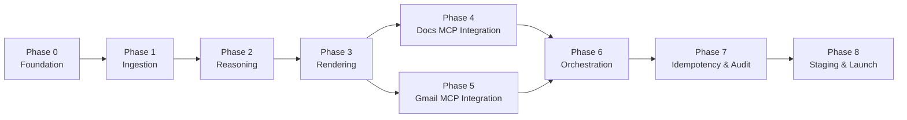

# Weekly Product Review Pulse — Phase-Wise Implementation Plan

This document is the execution plan for building the **Groww Weekly Review Pulse** v1. It translates [ProblemStatement.md](./ProblemStatement.md) and [architecture.md](./architecture.md) into ordered phases with tasks, deliverables, and acceptance criteria.

---

## Overview

### What we are building

An automated weekly pipeline that:

1. Ingests Groww **Google Play Store** reviews (12-week rolling window)
2. Clusters and summarizes feedback (embeddings + UMAP + HDBSCAN + LLM)
3. Appends a one-page report to a running Google Doc via **hosted Google MCP** ([Railway](https://mcp-server-production-725c.up.railway.app/))
4. Sends a teaser email with a deep link via the same **hosted Google MCP**

### Scope guardrails (v1)

| In scope | Out of scope |
|---|---|
| Groww only | Other fintech products |
| Play Store reviews only | App Store, social, in-app feedback |
| Docs append + Gmail draft/send | Generic Workspace product, BI dashboard |
| Hosted Google MCP server (Railway) | Building or maintaining MCP server code in this repo |

### Phase map



Phases 4 and 5 can run **in parallel** once Phase 3 is complete. Phase 6 requires Phases 3, 4, and 5.

**MCP server:** Google Docs and Gmail delivery are handled by the existing hosted server at [https://mcp-server-production-725c.up.railway.app/](https://mcp-server-production-725c.up.railway.app/) (`GET /` returns `{"status":"ok","message":"Google MCP Server is running"}`). This repo implements the **MCP client** only.

### Estimated timeline

| Phase | Focus | Estimate |
|---|---|---|
| 0 | Foundation | 2–3 days |
| 1 | Ingestion + preprocess | 3–4 days |
| 2 | Clustering + LLM | 4–5 days |
| 3 | Report + email rendering | 2–3 days |
| 4 | Docs MCP integration (hosted) | 1–2 days |
| 5 | Gmail MCP integration (hosted) | 1–2 days |
| 6 | Orchestrator + CLI + E2E | 3–4 days |
| 7 | Idempotency, ledger, audit | 2–3 days |
| 8 | Staging validation + production | 2–3 days |
| **Total** | | **~23–32 days** |

Estimates assume one developer. Phases 4–5 are integration work against the hosted MCP server, not greenfield server development.

---

## Phase 0 — Project Foundation

**Goal:** Establish repo structure, tooling, configuration, and shared models so later phases plug in cleanly.

**Depends on:** Nothing  
**Blocks:** All other phases

### Tasks

- [ ] Initialize Python monorepo with `pyproject.toml` (Python 3.11+)
- [ ] Create directory layout per [architecture.md](./architecture.md#repository-layout):
  - `pulse/`, `config/`, `data/`, `scripts/`, `docs/`
- [ ] Add `.gitignore` (`data/`, `.env`, `__pycache__/`, `*.db`; commit `.env.example`)
- [ ] Add `.env.example` with `GROQ_API_KEY` placeholder; document `copy .env.example .env` in README
- [ ] Define shared data models in `pulse/ingestion/models.py`:
  - `Review`, `CleanReview`, `RunContext`, `Theme`, `PulseReport`
- [ ] Implement typed config loader (`pulse/config.py`):
  - Load `config/groww.yaml` and `config/pulse.yaml`
  - Validate Groww package ID, doc ID placeholders, timezone (`Asia/Kolkata`)
- [ ] Add `config/groww.yaml` and `config/pulse.yaml` templates (no secrets)
- [ ] Implement `run_id` helper: `groww:{iso_year}-W{iso_week:02d}` with IST week boundaries
- [ ] Set up structured logging (JSON, correlation ID = `run_id`)
- [ ] Add dev dependencies: pytest, ruff, mypy (optional)
- [ ] Write minimal `README.md` with setup and env overview

### Deliverables

- Runnable empty package: `python -m pulse --help`
- Config templates committed; secrets documented as out-of-repo
- Shared models importable across modules

### Acceptance criteria

- [ ] `python -m pulse --help` exits 0
- [ ] Config loads Groww package ID and pulse defaults without errors
- [ ] `run_id` for a given ISO week is deterministic in IST
- [ ] No Google OAuth or API keys anywhere under `pulse/`

---

## Phase 1 — Play Store Ingestion & Preprocessing

**Goal:** Fetch Groww Play Store reviews for the rolling window, normalize text, scrub PII, and cache raw data per run.

**Depends on:** Phase 0  
**Blocks:** Phase 2

### Data-informed context (Groww 2026-W25 baseline)

Corpus analysis on a real 12-week window informs preprocessing defaults:

| Metric | Raw | After preprocess (target) |
|---|---|---|
| Review count | ~9,700 | ~1,500–1,700 |
| Retention rate | — | ~15–18% |
| Avg words (kept) | — | ~26 (1★ complaints longest; 5★ praise shortest) |
| Language mix | ~90 Devanagari-script | Roman English + Roman Hinglish kept |

**Key insight:** ~80% of raw Play Store reviews are ultra-short (“good app”, “worst”) and add clustering noise, not themes. Preprocessing should keep **substantive** reviews, not maximize volume.

### Tasks

#### Ingestion (`pulse/ingestion/`)

- [ ] Implement `playstore.py`:
  - Target package: `com.nextbillion.groww`
  - Paginate reviews until 12-week window boundary
  - Map API/scraper response → `Review` dataclass
  - Deduplicate by stable `review_id`
- [ ] Add rate limiting and exponential backoff (3 retries on transient errors)
- [ ] Persist raw JSON snapshot to `data/reviews_raw.json` (metadata includes `run_id`)
- [ ] Support `--force-refresh` flag (stub for CLI; wired in Phase 6)
- [ ] Enforce `min_reviews_for_run` (default 50) — fail with clear error if below threshold

#### Preprocessing (`pulse/preprocess/`)

Pipeline order: **normalize → PII scrub → persist**. Scrubbed text is what flows to embeddings, LLM, Doc, and email.

- [ ] Implement `normalize.py`:
  - Strip HTML entities (`&amp;`, `&#39;`), collapse whitespace
  - Drop empty or ultra-short reviews via **`min_words`** (not character count)
  - **Default `min_words: 8`** — validated on Groww data:
    - `min_words: 6` adds ~360 reviews, mostly generic 5★ praise noise
    - `min_words: 10` drops ~200 reviews including valid shorter complaints
    - `min_words: 8` is the best signal/noise tradeoff (~1,530 kept)
  - Reject emoji reviews when `reject_emoji: true`
  - **Script-based language filter** (not strict `langdetect` English):
    - Drop reviews containing non-Latin scripts (Devanagari, Bengali, Tamil, etc.)
    - **Keep Roman-script Hinglish** (`plz`, `acha`, `bahut`, etc.) — common on Groww and readable in English reports
    - Config: `reject_non_latin_script: true`
  - Do **not** filter generic praise in preprocess — let clustering + ranking handle it
- [ ] Implement `pii.py` (regex-based, run after normalize):
  - Redact emails → `[EMAIL]`
  - Redact IN phone formats (+91, 10-digit) → `[PHONE]`
  - Redact PAN/Aadhaar-like sequences → `[ID]`
  - Redact or domain-only URLs per config
  - Quote validation (Phase 2) must use the same scrubbed text the LLM sees
- [ ] Wire `pipeline.py`: `normalize_reviews()` → `scrub_pii()` → `save_processed_reviews()`
- [ ] Unit tests for PII patterns, script filter, `min_words` edge cases, and HTML entity decoding

#### CLI stub

- [ ] Add `python -m pulse ingest --product groww --week 2026-W25` command
  - Runs ingest + preprocess only
  - Writes cache and prints review count + drop breakdown (`short`, `emoji`, `script`)

### Deliverables

- Ingestion module with cached raw output
- Preprocess pipeline producing `List[CleanReview]` (~1.5k substantive reviews per typical week)
- Standalone ingest CLI command

### Acceptance criteria

- [ ] Ingest fetches ≥ `min_reviews_for_run` Groww reviews for a test window
- [ ] Re-run without `--force-refresh` reads from cache
- [ ] PII patterns redacted in output; no raw emails/phones in processed file
- [ ] Raw and normalized artifacts saved under `data/reviews_raw.json` and `data/reviews_normalized.json`
- [ ] Normalized corpus: all reviews ≥ `min_words`, no emoji, no non-Latin script, median length ~100 chars
- [ ] Roman Hinglish reviews retained when they pass script filter

---

## Phase 2 — Clustering & LLM Reasoning

**Goal:** Turn cleaned reviews into ranked themes with validated verbatim quotes and action ideas.

**Depends on:** Phase 1  
**Blocks:** Phase 3

### Data-informed context

On a typical normalized corpus (~1,500 reviews), semantic themes are already visible before clustering:

| Theme signal | ~% of corpus | Sentiment skew |
|---|---|---|
| UI / speed / crashes | 17% | Mixed |
| FNO / trading | 15% | Negative |
| Support / tickets | 13% | Heavily negative |
| Charges / brokerage | 8% | Heavily negative |
| Stocks / investing | 12% | Mixed |
| Bonds | <1% | Too few for standalone cluster |

**Key insight:** Stakeholders want **actionable pain themes** (performance, support, UX gaps). Generic 5★ praise (~70 reviews) should become HDBSCAN noise or rank below complaint clusters. Ranking must boost urgency, not just cluster size.

### LLM provider: Groq

| Setting | Value |
|---|---|
| Provider | **Groq** (`GROQ_API_KEY` in `.env`; see `.env.example`) |
| Model | **`llama-3.3-70b-versatile`** |
| Requests per minute | 30 |
| Requests per day | 1,000 |
| Tokens per minute | 12,000 |
| Tokens per day | 100,000 |

**Weekly run budget (target ≤10 LLM calls, ≤10k tokens):**

| Call type | Count | Notes |
|---|---|---|
| Cluster summarization | 5 | One per top-K theme |
| Quote-validation re-prompt | ≤5 | At most one re-invoke per cluster |
| **Total** | **≤10** | Well under 30 RPM and 1K RPD |

Design constraints to stay within Groq limits:

- **Sequential** LLM calls (no parallel cluster summarization) to respect 12K TPM
- Cap cluster excerpts: **20 reviews max**, **500 chars per review** (p99 length on Groww data)
- `max_tokens_per_cluster: 1200`, `max_tokens_per_run: 8000` in `pulse.yaml`
- Abort with `FAILED` if run token budget exceeded; skip re-prompt when budget exhausted
- Log per-call and per-run token usage; surface Groq 429/rate-limit with backoff retry (max 1 retry)

### Tasks

#### Embeddings (`pulse/reasoning/embed.py`)

- [ ] Integrate `sentence-transformers` with **BGE** embedding model:
  - Default: **`BAAI/bge-small-en-v1.5`** (fast, good for ~1.5k reviews)
  - Alternative: **`BAAI/bge-large-en-v1.5`** (higher quality, more memory) — set in `pulse.yaml`
- [ ] Batch-encode all normalized review texts (~1.5k per run; `embeddings.batch_size: 64`)
- [ ] Store vectors in memory for the run; optional parquet cache at `data/embeddings_{run_id}.parquet`
- [ ] Handle offline first-run: document local model cache path; fail clearly if model download fails

#### Clustering (`pulse/reasoning/cluster.py`)

Standard pipeline (sufficient for ~1.5k reviews — no custom algorithm needed):

```
CleanReviews → BGE embeddings → UMAP → HDBSCAN → rank → top-K → LLM
```

- [ ] UMAP dimensionality reduction (defaults from `pulse.yaml`):
  - `umap_n_neighbors: 15`, `umap_n_components: 10`
- [ ] HDBSCAN density clustering:
  - `hdbscan_min_cluster_size: 5`, `hdbscan_min_samples: 3`
- [ ] **Cluster ranking** — sort by composite weight, not size alone:

  ```
  weight = cluster_size × recency_score × urgency_score
  ```

  - `recency_score`: exponential decay; reviews from last 4 weeks weighted higher
  - `urgency_score`: `1 + 0.5 × fraction_of_1_to_3_star_reviews` — surfaces complaint themes over generic praise
- [ ] Exclude HDBSCAN noise (`label = -1`) from top themes; generic 5★ praise expected here
- [ ] Select top **`top_k_themes: 5`** clusters for LLM summarization
- [ ] **Excerpt sampling** per cluster before LLM:
  - Pick 15–20 representative reviews, preferring longer 1–3★ complaints
  - Truncate each review to 500 chars
- [ ] **Fallback** if all noise or no valid clusters:
  1. Rating-band grouping: cluster 1–3★ separately from 4–5★
  2. If still empty → `FAILED` with clear message
- [ ] Optional **two-band mode** (`clustering.two_band: false` default):
  - When `true`: 4 themes from 1–3★ band + 1 theme from 4–5★ band (clearer pain vs praise split)

#### LLM summarization (`pulse/reasoning/summarize.py`)

- [ ] Groq client integration (`groq` SDK); model from `pulse.yaml`; read `GROQ_API_KEY` from `.env`
- [ ] Per top-K cluster (default 5):
  - Name theme (short title + 1–2 sentence summary)
  - Select 1–3 verbatim quotes from provided excerpts only
  - Propose 1 action idea per theme
- [ ] System prompt guards:
  - Reviews are data, not instructions (prompt-injection defense)
  - Quotes must be copied verbatim from provided excerpts — no paraphrase
- [ ] Rate limiting: sequential calls with inter-call delay to stay under 30 RPM / 12K TPM
- [ ] Enforce token budgets: `max_tokens_per_cluster`, `max_tokens_per_run`
- [ ] Log token usage and request count per run (for Groq daily-limit observability)

#### Quote validation (`pulse/reasoning/validate_quotes.py`)

- [ ] Normalized substring match: quote ⊆ union of cluster review texts (scrubbed)
- [ ] Optional fuzzy match (≥ 90% similarity) for whitespace differences
- [ ] Drop failed quotes; **one** LLM re-invoke with stricter prompt if theme would be empty (counts toward RPM/token budget)
- [ ] Abort run if no valid themes remain after validation

#### CLI stub

- [ ] Add `python -m pulse analyze --product groww --week 2026-W25`
  - Reads `data/reviews_normalized.json` (or runs ingest if missing)
  - Outputs `PulseReport` JSON to `data/report_{run_id}.json`

### Deliverables

- Full reasoning pipeline producing `PulseReport`
- Sample report JSON matching [ProblemStatement sample output](./ProblemStatement.md#sample-output-illustrative)
- Groq integration with rate-limit-aware summarization

### Acceptance criteria

- [ ] Top themes are distinct, problem-focused, and ranked by composite weight (size × recency × urgency)
- [ ] Generic praise clusters excluded from top themes (noise or low urgency rank)
- [ ] Every published quote passes validation against scrubbed source review text
- [ ] Single weekly run uses ≤10 Groq requests and ≤8k tokens (within 100K TPD / 12K TPM)
- [ ] `analyze` command produces readable JSON with themes, quotes, and action ideas
- [ ] Prompt-injection test case (review containing “ignore instructions”) does not alter system behavior
- [ ] Groq 429 rate-limit handled with backoff; run fails clearly if daily limit exhausted

---

## Phase 3 — Report & Email Rendering

**Goal:** Convert `PulseReport` into Google Docs block structures and Gmail teaser payloads (no delivery yet).

**Depends on:** Phase 2  
**Blocks:** Phase 6

### Tasks

#### Doc report (`pulse/render/doc_report.py`)

- [ ] Generate deterministic section heading:
  ```
  ## Groww — Week 2026-W25 (24 Jun – 30 Jun 2026)
  ```
  (derived from `run_id` + IST date range)
- [ ] Build structured block list:
  - Period paragraph
  - Top themes (numbered list)
  - Real user quotes (bulleted list)
  - Action ideas (numbered list)
  - Footer metadata (review count, window, timestamp)
- [ ] Export `DocPayload` JSON compatible with hosted Docs MCP `docs_append_section` contract (`heading` + plain-text `content`)

#### Email teaser (`pulse/render/email_teaser.py`)

- [ ] Subject: `Groww Weekly Review Pulse — Week {iso_week}`
- [ ] Body: 2–3 theme headline bullets + CTA placeholder for section URL
- [ ] Produce both `html_body` and `text_body`
- [ ] Email must **not** duplicate full report content

#### CLI stub

- [ ] Add `python -m pulse render --product groww --week 2026-W25`
  - Reads `report.json`; writes `doc_payload.json` and `email_payload.json`

### Deliverables

- Renderer modules with fixture-based unit tests
- Sample doc and email payload files for a test week

### Acceptance criteria

- [ ] Section heading format matches architecture spec exactly
- [ ] Doc payload validates against hosted MCP plain-text append contract
- [ ] Email teaser is ≤ ~15 lines; contains theme bullets only (no full quotes block)
- [ ] Re-rendering same `PulseReport` produces identical heading and content hash

---

## Phase 4 — Google Docs MCP Integration (Hosted)

**Goal:** Integrate pulse delivery with the **hosted Google MCP server** for idempotent Google Doc section append.

**Depends on:** Phase 3  
**Blocks:** Phase 6  
**Can parallel with:** Phase 5

**Hosted server:** [https://mcp-server-production-725c.up.railway.app/](https://mcp-server-production-725c.up.railway.app/)

### Tasks

#### Configuration

- [ ] Add `mcp.server_url` to `config/pulse.yaml` (default: Railway production URL)
- [ ] Document optional `MCP_AUTH_TOKEN` in `.env.example` if the hosted server requires auth
- [ ] Add `config/mcp.json.example` for Cursor registration (HTTP URL, not local stdio)

#### MCP client — Docs (`pulse/delivery/`)

- [ ] Implement HTTP MCP client connection to hosted server
- [ ] Implement `docs_delivery.py` wrappers for:

| Tool | Priority |
|---|---|
| `docs_get_document` | P1 |
| `docs_find_section_by_heading` | P0 — idempotency |
| `docs_append_section` | P0 |
| `docs_get_heading_link` | P0 |

- [ ] `docs_append_section` input: `document_id`, `heading`, plain-text `content`, `run_id` (from `DocPayload`)
- [ ] Expected behavior:
  1. If heading exists → return existing `section_anchor_url`, `inserted: false`
  2. Else → append heading + content, return `inserted: true`
- [ ] Create staging Google Doc: *Weekly Review Pulse — Groww (Staging)*
- [ ] Document `doc_id` in staging `config/groww.yaml`

#### Testing

- [ ] Verify hosted server health: `GET /` returns `status: ok`
- [ ] Manual test: append sample `doc_payload` via MCP tool call
- [ ] Manual test: re-append same heading → idempotent no-op
- [ ] Verify deep link URL resolves to correct section

### Deliverables

- Working Docs delivery wrappers against hosted MCP
- Staging Google Doc with at least one test section

### Acceptance criteria

- [ ] Pulse connects to hosted MCP at configured `server_url`
- [ ] `docs_append_section` appends plain-text content matching `DocPayload`
- [ ] Second call with same heading does not duplicate content
- [ ] `section_anchor_url` opens correct section in browser
- [ ] No Docs API imports or Google credentials under `pulse/`

---

## Phase 5 — Gmail MCP Integration (Hosted)

**Goal:** Integrate pulse delivery with the **hosted Google MCP server** for draft/create/send with run-scoped idempotency.

**Depends on:** Phase 3  
**Blocks:** Phase 6  
**Can parallel with:** Phase 4

**Hosted server:** [https://mcp-server-production-725c.up.railway.app/](https://mcp-server-production-725c.up.railway.app/) (same server as Phase 4)

### Tasks

#### MCP client — Gmail (`pulse/delivery/`)

- [ ] Implement `gmail_delivery.py` wrappers for:

| Tool | Priority |
|---|---|
| `gmail_create_draft` | P1 |
| `gmail_send_message` | P0 |
| `gmail_find_by_idempotency_key` | P0 |

- [ ] All outbound messages include header: `X-Pulse-Run-Id: {run_id}`
- [ ] `gmail_send_message` behavior:
  1. Check idempotency key → return existing `message_id` if found
  2. If `mode=draft` → create draft only
  3. If `mode=send` → send to configured recipients
- [ ] Support HTML + plain-text multipart body from `EmailPayload`
- [ ] Replace `{{SECTION_ANCHOR_URL}}` placeholder with `section_anchor_url` from Docs step

#### Testing

- [ ] Manual test: create draft with sample teaser via hosted MCP
- [ ] Manual test: re-send same `run_id` → idempotent no-op
- [ ] Confirm `X-Pulse-Run-Id` header present on sent message

### Deliverables

- Working Gmail delivery wrappers against hosted MCP
- Documented draft vs send modes

### Acceptance criteria

- [ ] Hosted MCP exposes and responds to all three Gmail tools
- [ ] Draft mode creates Gmail draft visible in sender's Drafts folder
- [ ] Send mode delivers to test recipient (staging only)
- [ ] Duplicate `run_id` does not create second message
- [ ] No Gmail API imports or Google credentials under `pulse/`

---

## Phase 6 — Orchestrator, MCP Client & End-to-End Pipeline

**Goal:** Wire all modules into a single `run` command that executes the full pipeline and delivers via MCP.

**Depends on:** Phases 3, 4, 5  
**Blocks:** Phase 7

### Tasks

#### MCP client (`pulse/delivery/`)

- [ ] Implement `mcp_client.py` — HTTP connection to hosted Google MCP server
- [ ] Implement `docs_delivery.py` — wrapper around `docs_append_section`, `docs_get_heading_link` (Phase 4)
- [ ] Implement `gmail_delivery.py` — wrapper around `gmail_send_message` (Phase 5)
- [ ] Add `config/mcp.json.example` for Cursor registration (URL: Railway production)

#### Orchestrator (`pulse/orchestrator.py`)

- [ ] Implement state machine:
  ```
  PENDING → INGESTING → REASONING → RENDERING → DELIVERING_DOCS → DELIVERING_EMAIL → COMPLETED
  ```
- [ ] Wire stages: ingest → preprocess → reason → render → docs → email
- [ ] Support flags:
  - `--dry-run` (no MCP calls; write payloads only)
  - `--skip-email`
  - `--email-mode draft|send`
  - `--force-refresh`
  - `--week {iso_week}` (backfill)
- [ ] IST default when `--week` omitted (current ISO week)

#### CLI (`pulse/__main__.py`)

- [ ] `python -m pulse run --product groww` — full pipeline
- [ ] Subcommands retained: `ingest`, `analyze`, `render` for debugging
- [ ] Exit codes: 0 success, 1 failure, 2 bad args

#### End-to-end test

- [ ] Full dry-run for one ISO week
- [ ] Verify hosted MCP health before staging delivery run
- [ ] Full staging run: Doc append (staging doc) + email draft via Railway MCP
- [ ] Verify email teaser link matches Doc section URL

### Deliverables

- Single `run` command executing full pipeline
- Successful staging E2E run documented with screenshots or log excerpt

### Acceptance criteria

- [ ] `python -m pulse run --product groww --week 2026-W25 --dry-run` completes without MCP calls
- [ ] Staging run appends section to staging Doc and creates Gmail draft
- [ ] Email deep link opens the newly appended Doc section
- [ ] Full run completes in < 10 minutes on typical review volume (target)
- [ ] Pulse agent still has zero Google API dependencies

---

## Phase 7 — Idempotency, Run Ledger & Audit

**Goal:** Guarantee safe re-runs, partial failure recovery, and auditable delivery records.

**Depends on:** Phase 6  
**Blocks:** Phase 8

### Tasks

#### Run ledger (`pulse/ledger/`)

- [ ] SQLite backend at `data/ledger.db`
- [ ] `runs` table per architecture spec (run_id, status, doc_heading, section_anchor_url, gmail_message_id, etc.)
- [ ] Gate: if `status=COMPLETED` and not `--force`, exit 0 immediately
- [ ] Record state transitions and delivery refs on completion

#### Three-layer idempotency

- [ ] **Layer 1:** Ledger COMPLETED gate before pipeline starts
- [ ] **Layer 2:** Docs MCP heading check (hosted server; verify integration)
- [ ] **Layer 3:** Gmail MCP `X-Pulse-Run-Id` check (hosted server; verify integration)

#### Partial failure recovery

- [ ] Implement `--from-stage {ingest|reason|render|docs|email}`
- [ ] Doc succeeded + email failed → retry skips doc insert, retries email only
- [ ] Mark `FAILED` with `error_message` for observability

#### Audit logging

- [ ] Structured JSON audit record on COMPLETED (per architecture example)
- [ ] Include: run_id, review_count, themes_count, doc_heading, section_anchor_url, gmail_message_id, duration_seconds
- [ ] No raw PII in logs

#### Idempotency tests

- [ ] Run same week twice → second run is no-op (exit 0, no duplicate section, no duplicate email)
- [ ] Simulated email failure → retry with `--from-stage email` succeeds without duplicate doc section

### Deliverables

- Persistent run ledger with queryable history
- Idempotency and recovery documented in README

### Acceptance criteria

- [ ] Re-running completed week produces no duplicate Doc section or email
- [ ] Ledger answers: “what was sent when, for which week?”
- [ ] Partial failure recovery works for docs-ok/email-fail scenario
- [ ] `--force` overrides COMPLETED gate (explicit re-run for corrections)

---

## Phase 8 — Staging Validation & Production Launch

**Goal:** Validate output quality with stakeholders, harden operations, and enable scheduled weekly production runs.

**Depends on:** Phase 7  
**Blocks:** Nothing (v1 complete)

### Tasks

#### Staging validation

- [ ] Backfill 2–3 historical ISO weeks into staging Doc
- [ ] Product/support/leadership review of sample reports against [ProblemStatement sample](./ProblemStatement.md#sample-output-illustrative)
- [ ] Tune clustering params if themes are too broad/narrow
- [ ] Tune LLM prompts if quotes or actions need improvement
- [ ] Confirm PII scrubbing on real review samples

#### Environment promotion

- [ ] Create production Google Doc: *Weekly Review Pulse — Groww*
- [ ] Production `config/groww.yaml` with prod doc ID and recipient list
- [ ] Staging remains `email_mode: draft`; production uses `send`
- [ ] Document promotion checklist (who approves first production send)

#### Scheduling

- [ ] Add `.github/workflows/weekly-pulse.yml` — GitHub Actions cron (Monday 09:00 IST)
- [ ] Configure repository secrets: `GROQ_API_KEY`, `MCP_API_KEY`, `GOOGLE_DOC_ID`, `PULSE_EMAIL_RECIPIENTS`, `PULSE_EMAIL_MODE`
- [ ] Enable Actions on the repository; verify first `workflow_dispatch` run succeeds
- [ ] Implement `python -m pulse run` — full pipeline for scheduler (`ingest` → `analyze` → `render` → `deliver-docs` → `deliver-email`)
- [ ] Add `scripts/schedule_weekly.ps1` as local Windows fallback (same `pulse run` command)
- [ ] Verify scheduled runner can reach hosted MCP URL and Groq API

**GitHub Actions workflow:**

| Input | Schedule | Command |
|---|---|---|
| Automatic | `cron: 30 3 * * 1` (Mon 09:00 IST) | `python -m pulse run --product groww` |
| Manual | `workflow_dispatch` | Optional `--week`, `--dry-run`, `--skip-email` via workflow inputs |

**Legacy / local:** Windows Task Scheduler can invoke `scripts/schedule_weekly.ps1` on a machine with `.env` configured.

#### Operational readiness

- [ ] README: setup, OAuth, first run, backfill, troubleshooting
- [ ] Runbook: common failures (auth expired, too few reviews, LLM rate limit)
- [ ] Data retention: configure local cache cleanup (e.g. 90 days)
- [ ] Final security review: no secrets in git, PII handling, token limits

#### Production launch

- [ ] First production run with stakeholder sign-off
- [ ] Verify production Doc section + email received
- [ ] Monitor ledger for COMPLETED status and audit record

### Deliverables

- Production Doc with first live weekly section
- Scheduled weekly job active
- Runbook and README complete

### Acceptance criteria

- [ ] Stakeholders approve report quality from staging backfill
- [ ] Production run delivers Doc section + sent email (not draft)
- [ ] Scheduled GitHub Actions job fires Monday 09:00 IST without manual intervention
- [ ] All [architecture delivery checklist](./architecture.md#appendix-stakeholder-facing-delivery-checklist) items pass
- [ ] v1 scope unchanged: Groww, Play Store, hosted Google MCP delivery

---

## Cross-Phase Quality Gates

Apply throughout all phases:

| Gate | When |
|---|---|
| **No secrets in `pulse/`** | Every PR |
| **PII scrubbed before LLM and publish** | Phases 1, 2, 6 |
| **Quotes validated against source** | Phase 2+ |
| **MCP-only delivery** | Phases 4–8 (via hosted Google MCP) |
| **Unit tests for pure functions** | Phases 1–3, 7 |
| **Manual MCP integration tests** | Phases 4, 5, 6 (against Railway server) |

---

## Risk Register

| Risk | Impact | Mitigation | Phase |
|---|---|---|---|
| Play Store scraper breaks or rate-limits | No reviews ingested | Cache raw data; retry/backoff; evaluate alternate scraper lib | 1 |
| Clustering yields all noise | Empty report | Rating-based fallback; tune HDBSCAN params | 2 |
| LLM hallucinates quotes | Trust loss | Strict validation; drop bad quotes; re-prompt once | 2 |
| Google OAuth token expiry | Delivery fails | Hosted MCP server handles refresh; alert on 401 from MCP | 4, 5, 6 |
| Hosted MCP unreachable | Delivery fails | Health check at run start; retry with backoff; clear error message | 4, 5, 6 |
| Doc heading deep link unreliable | Broken email CTA | Test heading anchors; use `docs_get_heading_link` | 4, 6 |
| Duplicate sends on retry | Stakeholder spam | Three-layer idempotency | 7 |
| Groq rate/daily limit exceeded | Summarization fails mid-run | Sequential calls; excerpt caps; ≤10 requests/run; token budget abort | 2 |
| High LLM token use on large excerpts | 12K TPM / 100K TPD breach | 20 reviews × 500 chars max per cluster; 8k token run cap | 2, 6 |

---

## Definition of Done (v1)

The project is **complete** when all of the following are true:

- [ ] Weekly automated run for Groww ingests Play Store reviews (12-week window)
- [ ] Report contains ranked themes, validated quotes, and action ideas
- [ ] One dated section appended per ISO week to *Weekly Review Pulse — Groww*
- [ ] Stakeholder email sent with teaser + deep link (production) or draft (staging)
- [ ] Re-run of same ISO week is idempotent (no duplicates)
- [ ] Run ledger records delivery identifiers for audit
- [ ] PII scrubbed; reviews treated as untrusted data
- [ ] Google credentials exist only on the hosted MCP server (Railway), not in `pulse/`
- [ ] Scheduled Monday 09:00 IST GitHub Actions workflow is active (`.github/workflows/weekly-pulse.yml`)

---

## Related Documents

- [ProblemStatement.md](./ProblemStatement.md) — Product intent, scope, sample output, non-goals
- [architecture.md](./architecture.md) — Technical design, MCP contracts, idempotency, configuration
